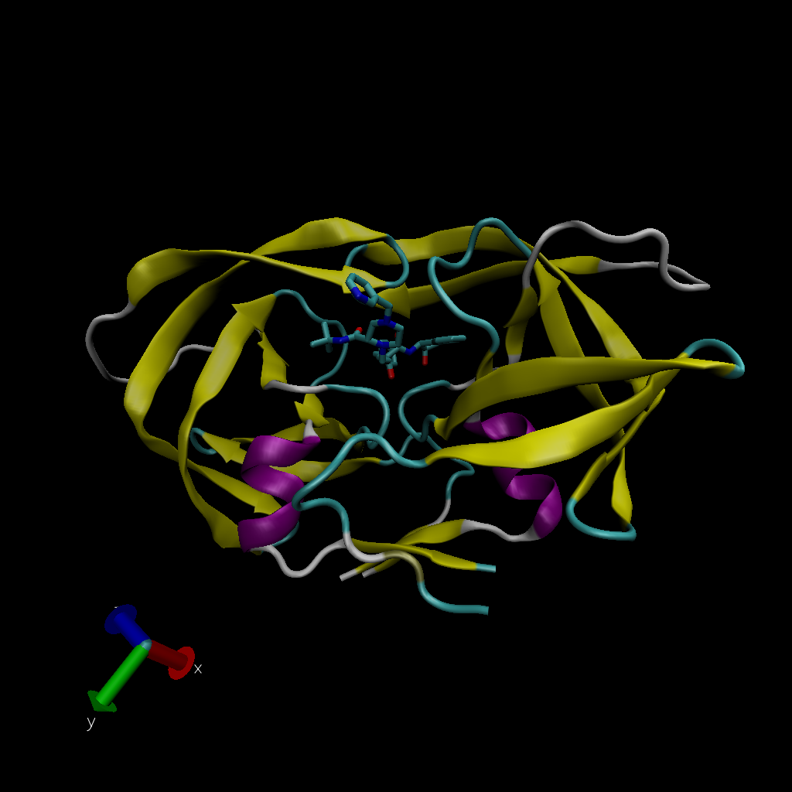
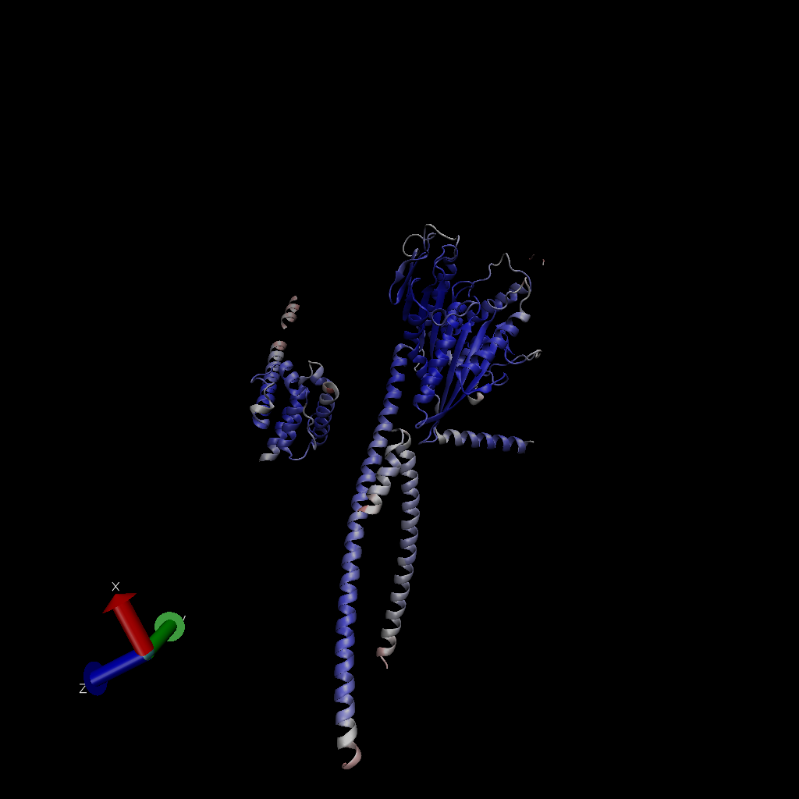

# Taking a Quick Look at PDB

The PDB is the main repository of biomolecular structure data.

Here we grab the current composition statistics from the web page: <https://www.rcsb.org/stats/summary>

```{r}
tbl <- read.csv("Data Export Summary.csv", row.names = 1)
tbl
```

Question 1: What percentage of structures in the PDB are solved by X-Ray and Electron Microscopy.

```{r}
#Check the sums of all the columns in the data set
#colSums(tbl)

#Sum the relevant columns and divide that number by the sum of the "total" column, multiplying the answer by 100 to achieve a percentage
n.type <- colSums(tbl)
n.type / n.type["Total"] * 100
#If we were to use the above method the generate the answer for the question, we would want store n.type / n.type["Total"] * 100 to a variable and then type 'r variable[1]' to output the X-ray percentage and 'r variable[3]' to output the EM percentage, since the output is a vector with sevaral values with discrete locations

#The less elegant way I came up with
XR <- sum(tbl[,1]) / sum(tbl[,7]) * 100 
EM <- sum(tbl[,3]) / sum(tbl[,7]) * 100 
XR
EM

#How do we get an output with only 3 decimal places?
XRr <- round(XR, digits = 3)
XRr
EMr <- round(EM, digits = 3)
EMr
```

The proportion of of X-ray structures is `r XRr`% of the total structures

The proportion of of EM structures is `r EMr`% of the total structures

Question 2: What proportion of structures in the PDB are protein?

```{r}
#Take the total number of protein entries (located in row 1, column 7) and divide it by the sum of the total column
Prot <- round(tbl[1,7] / sum(tbl[,7]) * 100, digits = 3)
Prot

#Barry's more elegant solution
#tbl$Total[1]
#This allows you to not have to know the column number, just the name, and you can still specify the row number you want to access
#This also protects you from issues if the database changes at all, still searching for the 'Total' column regardless of the column position
```

The proportion of entries that are protein structures is `r Prot`%

Question 3: Type HIV in the PDB website search box on the home page and determine how many HIV-1 protease structures are in the current PDB?

Using the HIV query, and the protease subquery, I found 1225 structures

Question 4: Water molecules normally have 3 atoms. Why do we see just one atom per water molecule in this structure?

We can see the oxygen, but not the hydrogens, because the resolution of the structure is 2 angstroms, which is larger than the size of hydrogen but smaller than the size of oxygen.

Question 5: There is a conserved water molecule in the binding site. Can you identify this water molecule? What residue number does this water molecule have (see note below)?

The water is at residue number 308

# Inserting an Image File



# Bio3D for Structural Bioinformatics

```{r}
library(bio3d)

#We need to access the online PDB file for 1HSG
pdb <- read.pdb("1hsg")
pdb
```

```{r}
#Looking at the atom column of the pdb dataset
head(pdb$atom)
```

Q7: How many amino acid residues are there in this pdb object?

198 amino acids

Q8: Name one of the two non-protein residues?

Water (also the small molecule)

Q9: How many protein chains are in this structure?

There are two chains

# Comparative Analysis of Protein Structures

Read a single ADK structure from the database

```{r}
# Install packages in the R console not your Rmd

#install.packages("bio3d")
#install.packages("ggplot2")
#install.packages("ggrepel")
#install.packages("devtools")
#install.packages("BiocManager")
#BiocManager::install("msa")
#devtools::install_bitbucket("Grantlab/bio3d-view")

#Be sure to load in all of the packages necessary for this
library("bio3d")
library("ggplot2")
library("ggrepel")
library("devtools")
library("BiocManager")
aa <- get.seq("1ake_A")
aa
```

Question 10: Which of the packages above is found only on BioConductor and not CRAN?

The 'msa' package

Question 11: Which of the above packages is not found on BioConductor or CRAN?:

The 'bio3d-view' package

Question 12: True or False? Functions from the devtools package can be used to install packages from GitHub and BitBucket?

True

Question 13: How many amino acids are in this sequence, i.e. how long is this sequence?

This sequence contains 214 amino acid residues

Now let's blast for related sequences

```{r}
#Blast search for matches to 'aa' sequence
blast <- blast.pdb(aa)
```

```{r}
#Plotting results of the blast
hits <- plot(blast)
```

```{r}
#We should look at some of the top hits
hits$pdb.id
```

# Using AlphaFold

Here is an image of a new structure based on sequence


