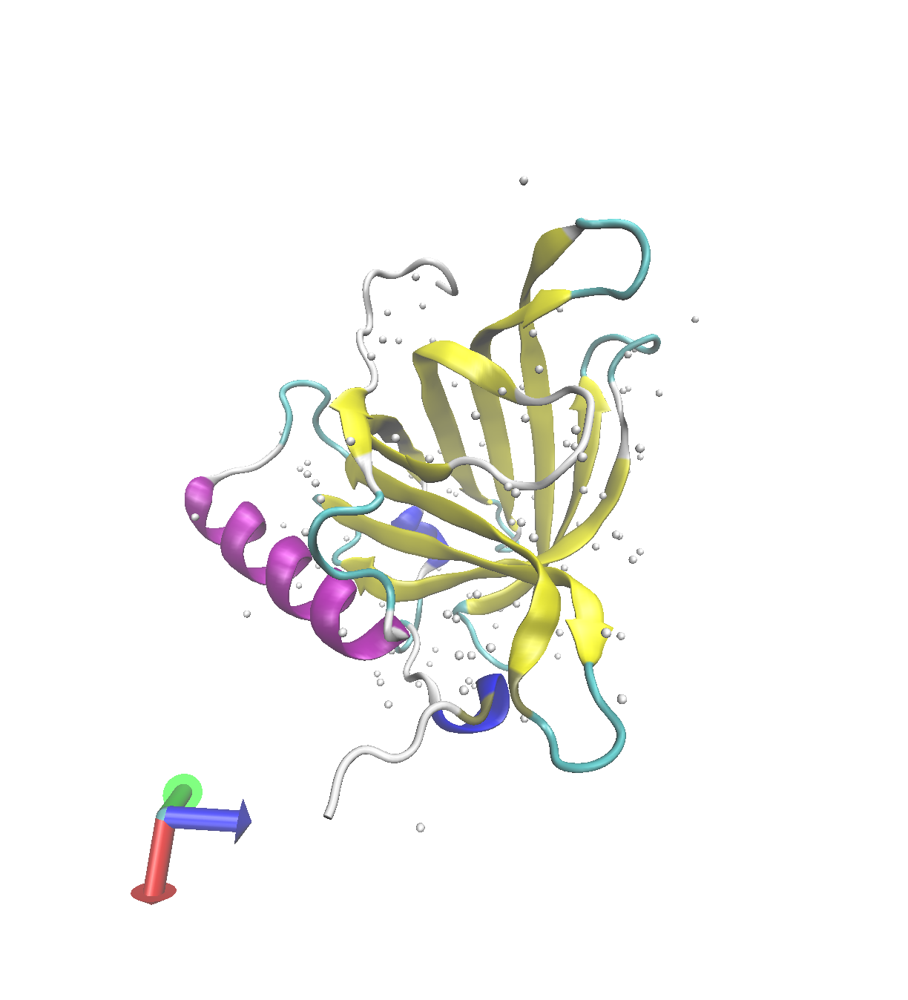

```{r}
library(seqinr)
library(bio3d)

gene_align <- read.alignment("Gene_Alignment.fst", format = "fasta")
```

```{r}
ID_mat <- seqidentity(as.matrix(gene_align))
```

```{r}
heatmap(ID_mat, cexRow = 0.6, cexCol = 0.6)
```

```{r}
clam_seq <- "QVGMKPGWILTTDYENYAVIYSCWSE-QESGECHPSNTYVAVLQRKTDDISPS--HRVEIDRALRRACVEPKKLSKITHYGYCLGR"

blast <- blast.pdb(clam_seq)
```

```{r}
hits <- plot(blast)
```

```{r}
hits$pdb.id
```

```{r}
library(bio3d)
hit1 <- pdb.annotate("1AQB_A")
hit2 <- pdb.annotate("1JYJ_A")
hit3 <- pdb.annotate("6QBA_A")
top2 <- full_join(hit1, hit2)
top3 <- full_join(top2, hit3)
```

```{r}
head(blast$hit.tbl, 3)
```

```{r}
partial_full <- cbind(top3, blast$hit.tbl)

colrmv_data <- subset(partial_full, select = -c(chainId, macromoleculeType, chainLength, pfam, ligandId, ligandName, structureTitle, citation, rObserved, rFree, rWork, spaceGroup, queryid, subjectids, alignmentlength, mismatches, gapopens, q.start, q.end, s.start, s.end, bitscore, positives, mlog.evalue, pdb.id, acc))

full_data <- slice_tail(colrmv_data, n = 3)
full_data
```


